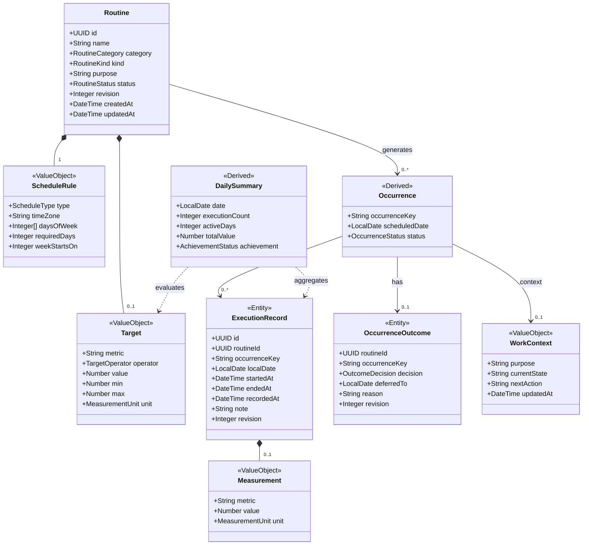

```mermaid

classDiagram
    direction TB

    class Routine {
        +UUID id
        +String name
        +RoutineCategory category
        +RoutineKind kind
        +String purpose
        +RoutineStatus status
        +Integer revision
        +DateTime createdAt
        +DateTime updatedAt
    }

    class ScheduleRule {
        <<ValueObject>>
        +ScheduleType type
        +String timeZone
        +Integer[] daysOfWeek
        +Integer requiredDays
        +Integer weekStartsOn
    }

    class Target {
        <<ValueObject>>
        +String metric
        +TargetOperator operator
        +Number value
        +Number min
        +Number max
        +MeasurementUnit unit
    }

    class Occurrence {
        <<Derived>>
        +String occurrenceKey
        +LocalDate scheduledDate
        +OccurrenceStatus status
    }

    class ExecutionRecord {
        <<Entity>>
        +UUID id
        +UUID routineId
        +String occurrenceKey
        +LocalDate localDate
        +DateTime startedAt
        +DateTime endedAt
        +DateTime recordedAt
        +String note
        +Integer revision
    }

    class Measurement {
        <<ValueObject>>
        +String metric
        +Number value
        +MeasurementUnit unit
    }

    class OccurrenceOutcome {
        <<Entity>>
        +UUID routineId
        +String occurrenceKey
        +OutcomeDecision decision
        +LocalDate deferredTo
        +String reason
        +Integer revision
    }

    class DailySummary {
        <<Derived>>
        +LocalDate date
        +Integer executionCount
        +Integer activeDays
        +Number totalValue
        +AchievementStatus achievement
    }

    class WorkContext {
        <<ValueObject>>
        +String purpose
        +String currentState
        +String nextAction
        +DateTime updatedAt
    }

    Routine *-- "1" ScheduleRule
    Routine *-- "0..1" Target
    Routine --> "0..*" Occurrence : generates
    Occurrence --> "0..*" ExecutionRecord : includes
    Occurrence --> "0..1" OccurrenceOutcome : has
    ExecutionRecord *-- "0..1" Measurement
    Occurrence --> "0..1" WorkContext : context
    DailySummary ..> ExecutionRecord : aggregates
    DailySummary ..> Target : evaluates

```
