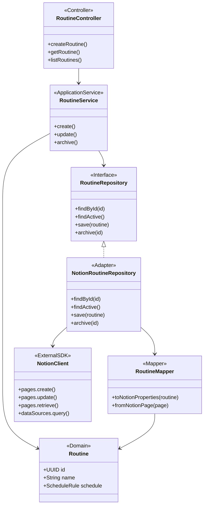

```mermaid

classDiagram
    direction TB

    class RoutineController {
        <<Controller>>
        +createRoutine()
        +getRoutine()
        +listRoutines()
    }

    class RoutineService {
        <<ApplicationService>>
        +create()
        +update()
        +archive()
    }

    class RoutineRepository {
        <<Interface>>
        +findById(id)
        +findActive()
        +save(routine)
        +archive(id)
    }

    class NotionRoutineRepository {
        <<Adapter>>
        +findById(id)
        +findActive()
        +save(routine)
        +archive(id)
    }

    class RoutineMapper {
        <<Mapper>>
        +toNotionProperties(routine)
        +fromNotionPage(page)
    }

    class NotionClient {
        <<ExternalSDK>>
        +pages.create()
        +pages.update()
        +pages.retrieve()
        +dataSources.query()
    }

    class Routine {
        <<Domain>>
        +UUID id
        +String name
        +ScheduleRule schedule
    }

    RoutineController --> RoutineService
    RoutineService --> RoutineRepository
    RoutineService --> Routine
    RoutineRepository <|.. NotionRoutineRepository
    NotionRoutineRepository --> RoutineMapper
    NotionRoutineRepository --> NotionClient
    RoutineMapper --> Routine

```
