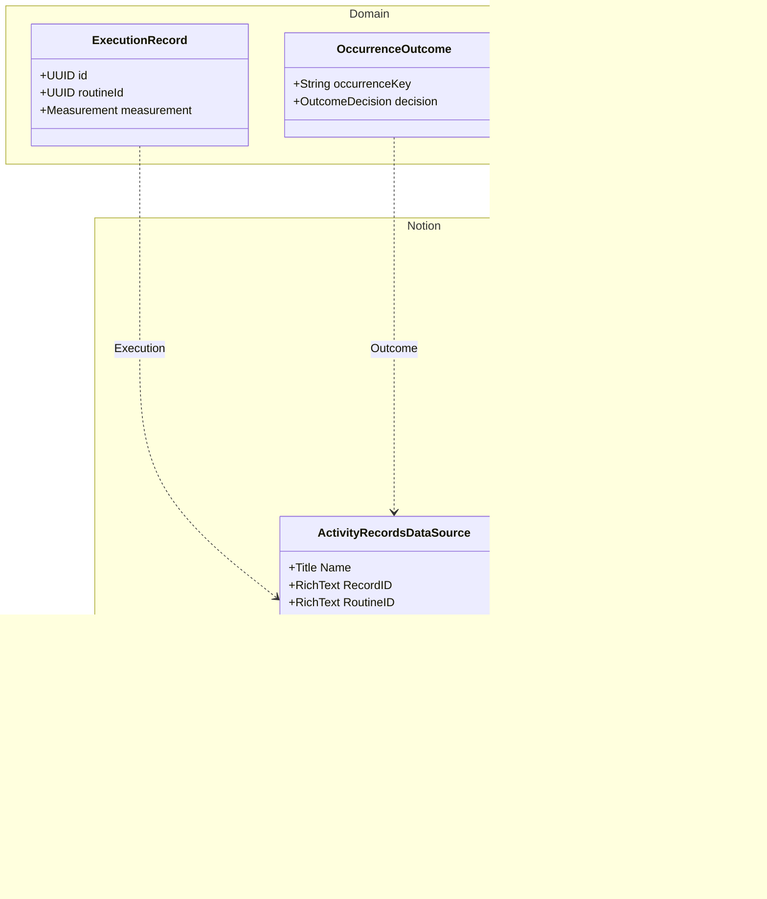

```mermaid

classDiagram
    direction TB

    namespace Domain {
        class Routine {
            +UUID id
            +ScheduleRule schedule
            +Target target
        }

        class ExecutionRecord {
            +UUID id
            +UUID routineId
            +Measurement measurement
        }

        class OccurrenceOutcome {
            +String occurrenceKey
            +OutcomeDecision decision
        }
    }

    namespace Notion {
        class RoutinesDataSource {
            +Title Name
            +RichText RoutineID
            +Select Category
            +Select Kind
            +Select Status
            +RichText Purpose
            +RichText ScheduleJSON
            +RichText TargetJSON
            +Number Revision
        }

        class ActivityRecordsDataSource {
            +Title Name
            +RichText RecordID
            +RichText RoutineID
            +Select RecordType
            +RichText OccurrenceKey
            +Date LocalDate
            +Date StartedAt
            +Date EndedAt
            +Date RecordedAt
            +RichText Metric
            +Number Value
            +Select Unit
            +Select Decision
            +Date DeferredTo
            +RichText Note
            +Number Revision
        }
    }

    Routine ..> RoutinesDataSource : mapped to
    ExecutionRecord ..> ActivityRecordsDataSource : Execution
    OccurrenceOutcome ..> ActivityRecordsDataSource : Outcome

    RoutinesDataSource "1" --> "0..*" ActivityRecordsDataSource : RoutineID

```
