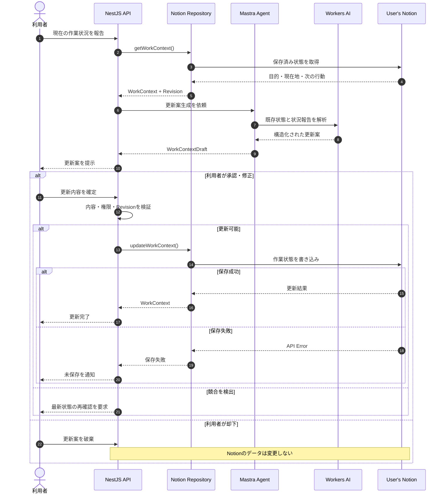

```mermaid

sequenceDiagram
    autonumber
    actor User as 利用者
    participant API as NestJS API
    participant Repo as Notion Repository
    participant AI as Mastra Agent
    participant LLM as Workers AI
    participant Notion as User's Notion

    User->>API: 現在の作業状況を報告

    API->>Repo: getWorkContext()
    Repo->>Notion: 保存済み状態を取得
    Notion-->>Repo: 目的・現在地・次の行動
    Repo-->>API: WorkContext + Revision

    API->>AI: 更新案生成を依頼
    AI->>LLM: 既存状態と状況報告を解析
    LLM-->>AI: 構造化された更新案
    AI-->>API: WorkContextDraft
    API-->>User: 更新案を提示

    alt 利用者が承認・修正
        User->>API: 更新内容を確定
        API->>API: 内容・権限・Revisionを検証

        alt 更新可能
            API->>Repo: updateWorkContext()
            Repo->>Notion: 作業状態を書き込み

            alt 保存成功
                Notion-->>Repo: 更新結果
                Repo-->>API: WorkContext
                API-->>User: 更新完了
            else 保存失敗
                Notion-->>Repo: API Error
                Repo-->>API: 保存失敗
                API-->>User: 未保存を通知
            end

        else 競合を検出
            API-->>User: 最新状態の再確認を要求
        end

    else 利用者が却下
        User->>API: 更新案を破棄
        Note over API,Notion: Notionのデータは変更しない
    end

```
