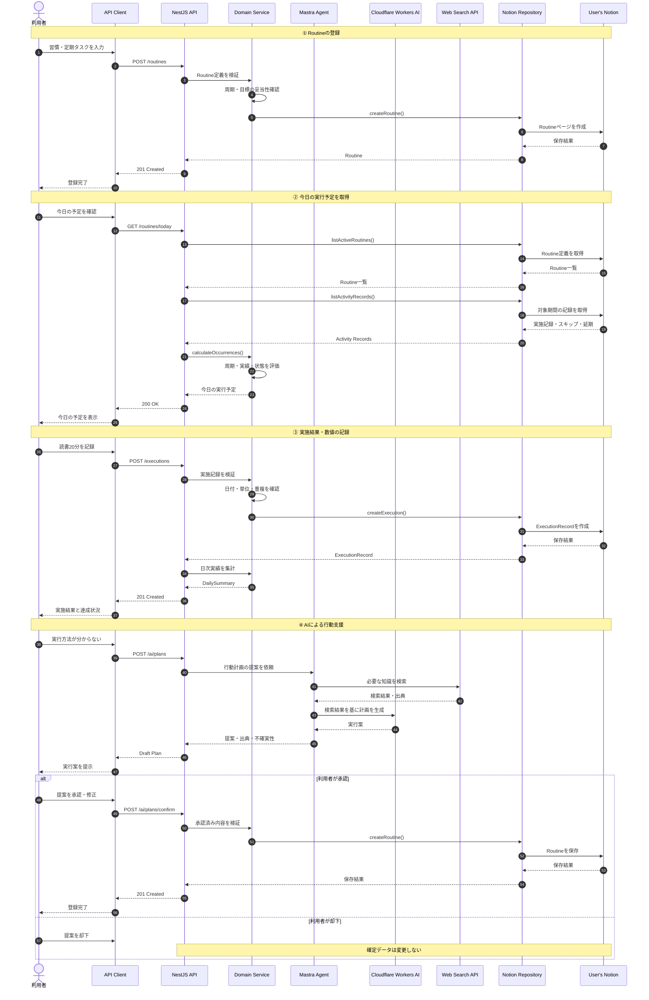

```mermaid
sequenceDiagram
    autonumber
    actor User as 利用者
    participant Client as API Client
    participant API as NestJS API
    participant Domain as Domain Service
    participant AI as Mastra Agent
    participant LLM as Cloudflare Workers AI
    participant Search as Web Search API
    participant Repo as Notion Repository
    participant Notion as User's Notion

    Note over User,Notion: ① Routineの登録

    User->>Client: 習慣・定期タスクを入力
    Client->>API: POST /routines
    API->>Domain: Routine定義を検証
    Domain->>Domain: 周期・目標の妥当性確認
    Domain->>Repo: createRoutine()
    Repo->>Notion: Routineページを作成
    Notion-->>Repo: 保存結果
    Repo-->>API: Routine
    API-->>Client: 201 Created
    Client-->>User: 登録完了

    Note over User,Notion: ② 今日の実行予定を取得

    User->>Client: 今日の予定を確認
    Client->>API: GET /routines/today
    API->>Repo: listActiveRoutines()
    Repo->>Notion: Routine定義を取得
    Notion-->>Repo: Routine一覧
    Repo-->>API: Routine一覧

    API->>Repo: listActivityRecords()
    Repo->>Notion: 対象期間の記録を取得
    Notion-->>Repo: 実施記録・スキップ・延期
    Repo-->>API: Activity Records

    API->>Domain: calculateOccurrences()
    Domain->>Domain: 周期・実績・状態を評価
    Domain-->>API: 今日の実行予定
    API-->>Client: 200 OK
    Client-->>User: 今日の予定を表示

    Note over User,Notion: ③ 実施結果・数値の記録

    User->>Client: 読書20分を記録
    Client->>API: POST /executions
    API->>Domain: 実施記録を検証
    Domain->>Domain: 日付・単位・重複を確認
    Domain->>Repo: createExecution()
    Repo->>Notion: ExecutionRecordを作成
    Notion-->>Repo: 保存結果
    Repo-->>API: ExecutionRecord
    API->>Domain: 日次実績を集計
    Domain-->>API: DailySummary
    API-->>Client: 201 Created
    Client-->>User: 実施結果と達成状況

    Note over User,Notion: ④ AIによる行動支援

    User->>Client: 実行方法が分からない
    Client->>API: POST /ai/plans
    API->>AI: 行動計画の提案を依頼
    AI->>Search: 必要な知識を検索
    Search-->>AI: 検索結果・出典
    AI->>LLM: 検索結果を基に計画を生成
    LLM-->>AI: 実行案
    AI-->>API: 提案・出典・不確実性
    API-->>Client: Draft Plan
    Client-->>User: 実行案を提示

    alt 利用者が承認
        User->>Client: 提案を承認・修正
        Client->>API: POST /ai/plans/confirm
        API->>Domain: 承認済み内容を検証
        Domain->>Repo: createRoutine()
        Repo->>Notion: Routineを保存
        Notion-->>Repo: 保存結果
        Repo-->>API: 保存結果
        API-->>Client: 201 Created
        Client-->>User: 登録完了
    else 利用者が却下
        User->>Client: 提案を却下
        Note over API,Notion: 確定データは変更しない
    end
```
