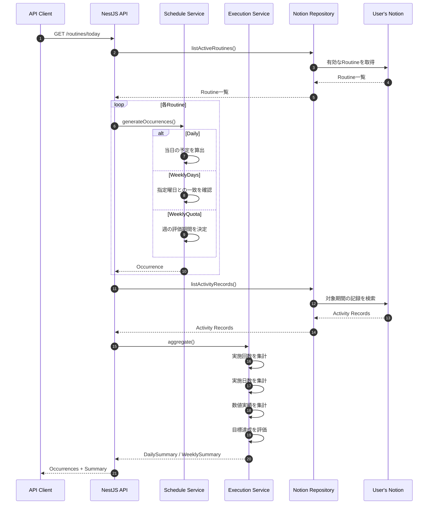

```mermaid

sequenceDiagram
    autonumber
    participant Client as API Client
    participant API as NestJS API
    participant Schedule as Schedule Service
    participant Execution as Execution Service
    participant Repo as Notion Repository
    participant Notion as User's Notion

    Client->>API: GET /routines/today

    API->>Repo: listActiveRoutines()
    Repo->>Notion: 有効なRoutineを取得
    Notion-->>Repo: Routine一覧
    Repo-->>API: Routine一覧

    loop 各Routine
        API->>Schedule: generateOccurrences()

        alt Daily
            Schedule->>Schedule: 当日の予定を算出
        else WeeklyDays
            Schedule->>Schedule: 指定曜日との一致を確認
        else WeeklyQuota
            Schedule->>Schedule: 週の評価期間を決定
        end

        Schedule-->>API: Occurrence
    end

    API->>Repo: listActivityRecords()
    Repo->>Notion: 対象期間の記録を検索
    Notion-->>Repo: Activity Records
    Repo-->>API: Activity Records

    API->>Execution: aggregate()

    Execution->>Execution: 実施回数を集計
    Execution->>Execution: 実施日数を集計
    Execution->>Execution: 数値実績を集計
    Execution->>Execution: 目標達成を評価

    Execution-->>API: DailySummary / WeeklySummary
    API-->>Client: Occurrences + Summary

```
